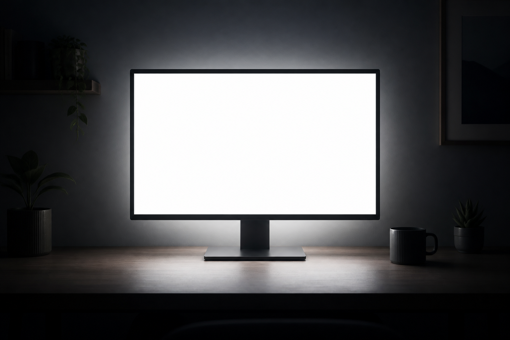

# Lumos

## Description

Simple desktop application that opens a clean, maximized white window.



## How to use

Lumos has intentionally very little interface. Move the mouse to the top-right corner to reveal **Nox** and click it to close the application.

You can also press `Ecs` to close Lumos, or `F11` to toggle fullscreen mode.

## How to run

Download the latest packages from the [Releases](https://github.com/ceccon-t/ubuntu-lumos/releases) section of the repository. 

When downloading, choose if you want the runnable version (.AppImage), or the installable one (.deb), and set the chosen one up accordingly.

### Run the application during development

Install the dependencies and start the application:

```bash
npm install
npm start
```

## How to build the project

To generate Linux packages, run:

```bash
npm run build:linux
```

This creates an AppImage and a Debian package in the `release` directory. Release builds are also created automatically as draft GitHub releases when a version tag such as `v1.0.0` is pushed.
